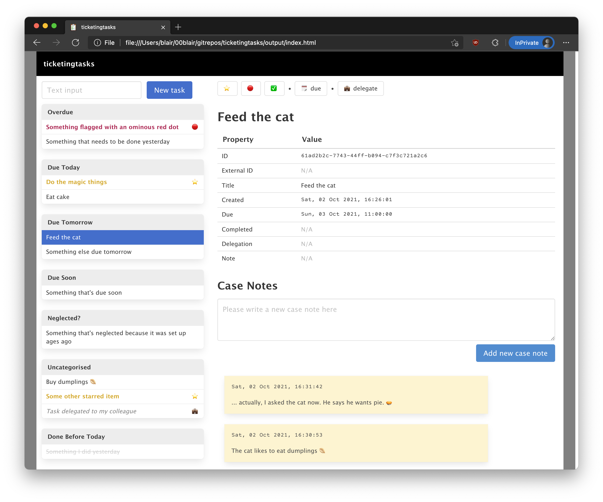

# ticketingtasks

**A very simple personal ticketing system (task management / todo-list system).**

Some functionalities are not yet implemented. I made this in a hurry because I needed something for myself urgently while coping with unprecedented workload during the final months of a PhD 😅

If you want to use this, just clone this repo and open `output/index.html` in your browser. That's it, no further installation necessary, this runs 100% in your browser and all data is managed by [Window.localStorage](https://developer.mozilla.org/en-US/docs/Web/API/Window/localStorage).



## Technology stack

Only if you're interested, because [not everyone is](https://twitter.com/shituserstory/status/1438105256206999560).

- TypeScript ✨
- SCSS 🌈
- Generating a single page using `generate.sh` (is there even a name for this technique? idk, I do it a lot these days)
- Bulma
- jQuery
- `Window.localStorage` &mdash; truly magical
- Some icons by [Yusuke Kamiyamane](http://p.yusukekamiyamane.com/). Licensed under a [Creative Commons Attribution 3.0 License](https://creativecommons.org/licenses/by/3.0/).

## Manage ticket using console (provisional/interim solution)

Rename the current ticket:

```js
DataHelper.globalCurrentSelectedItem.title = 'New title goes here please';
```

To make changes persistent, save changes to LocalStorage:

```js
DataHelper.saveItemsToLocalStorage();
```
