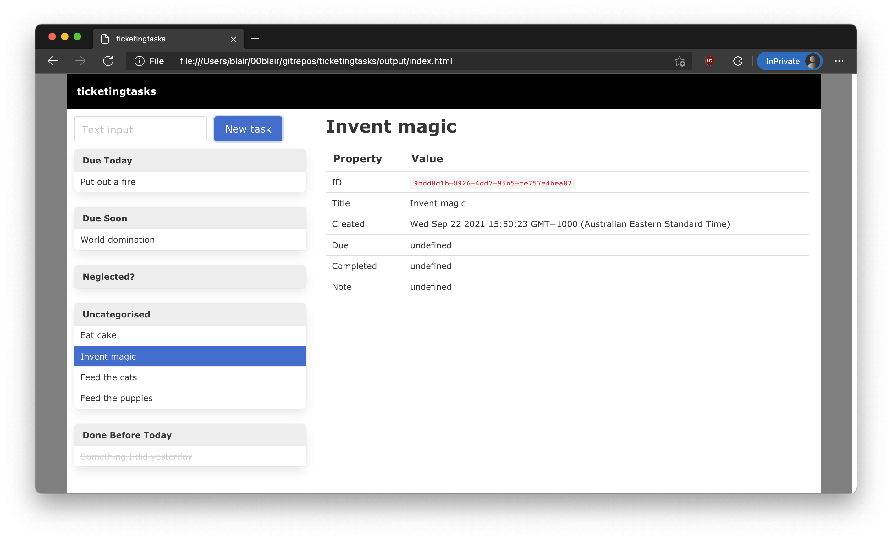

# ticketingtasks

**A very simple personal ticketing system (task management / todo-list system).**

Most functionalities are not yet implemented. I made this in a hurry because I needed something for myself urgently.



## Technologies

- TypeScript ✨
- SCSS 🌈
- Generating a single page using `generate.sh` (is there even a name for this technique? idk, I do it a lot these days)
- Bulma
- jQuery
- `Window.localStorage` &mdash; truly magical
- Some icons by [Yusuke Kamiyamane](http://p.yusukekamiyamane.com/). Licensed under a [Creative Commons Attribution 3.0 License](https://creativecommons.org/licenses/by/3.0/).

## Manage ticket using console (provisional/interim solution)

Rename the current ticket:

```js
DataHelper.globalCurrentSelectedItem.title = 'New title goes here please';
```

Add a **note** ot the current ticket:

```js
DataHelper.globalCurrentSelectedItem.note = 'This is such note, very text, wow.';
```

Set the due date for a ticket:

```js
DataHelper.globalCurrentSelectedItem.dueDate = new Date("2021-09-24");
```

Set the current ticket to be completed:

```js
DataHelper.globalCurrentSelectedItem.completedTs = new Date();
```

To make changes persistent, save changes to LocalStorage:

```js
DataHelper.saveItemsToLocalStorage();
```